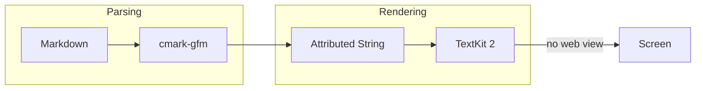

# A Bloody Simple Markdown Viewer

A native macOS viewer with **no web view**, *no JavaScript*, and no helper
processes. It opens instantly and stays small. :rocket:

## Text and inline formatting

Regular text with **bold**, *italic*, ***both***, `inline code`,
~~strikethrough~~, and a [link to GitHub](https://github.com).

Emoji shortcodes work too: :tada: :fire: :white_check_mark: :bug:

## GitHub alerts

> [!NOTE]
> Useful information that users should know, even when skimming.

> [!TIP]
> Helpful advice for doing things better or more easily.

> [!IMPORTANT]
> Key information users need to know to achieve their goal.

> [!WARNING]
> Urgent info that needs immediate user attention to avoid problems.

> [!CAUTION]
> Advises about risks or negative outcomes of certain actions.

## Block quotes

> A plain block quote.
>
> > And one nested inside it, to show the depth bars.

## Tables

| Language   | Parser    | Speed    | Notes                |
|:-----------|:----------|---------:|:---------------------|
| Swift      | native    |     fast | The implementation   |
| C          | cmark-gfm |  fastest | Via swift-markdown   |
| JavaScript | none      |      n/a | Deliberately absent  |

## Code

```swift
struct Renderer {
    let theme: Theme

    func render(_ source: String) -> NSAttributedString {
        // Walks the tree straight into styled text.
        let document = Document(parsing: source)
        return visit(document)
    }
}
```

```python
def fibonacci(n: int) -> int:
    """Classic, and a good syntax test."""
    a, b = 0, 1
    for _ in range(n):
        a, b = b, a + b
    return a
```

```bash
# Install and register
make install
open -a Markdown ~/Desktop/notes.md
```

## Lists

- Unordered item
- Another item
  - Nested one level
  - And another
    - Nested twice
- Back to the top level

1. First ordered item
2. Second ordered item
3. Third ordered item

### Task list

- [x] Parse GitHub Flavored Markdown
- [x] Render tables without `NSTextTable`
- [ ] Math and Mermaid diagrams
- [ ] Quick Look extension

---

That horizontal rule above is a real one.

## Task states

The viewer understands more than GitHub's two markers, and can filter to just
the ones you care about from the checklist button in the title bar.

- [x] Some
- [✅] Other
- [✔️] Bullet
- [X] Point
- [OK] Such
- [DONE] as those
- [~] in Arbeit
- [WIP] also in progress
- [ ] still open
- [TODO] also open

## Math

Inline math sits on the baseline: $E = mc^2$, and so does
$\hat{y} = \sigma(W^\top x + b)$ over $\mathbb{R}^{n \times d}$.

Display math gets its own line:

$$
\mathcal{L}(\theta) = -\frac{1}{N} \sum_i \log p_\theta(y_i)
$$

ChatGPT's delimiters work too: \(x = \frac{-b \pm \sqrt{b^2-4ac}}{2a}\)

## Diagrams



Diagram types the renderer does not yet cover, such as Gantt charts, fall back
to showing their source so nothing is ever lost.
