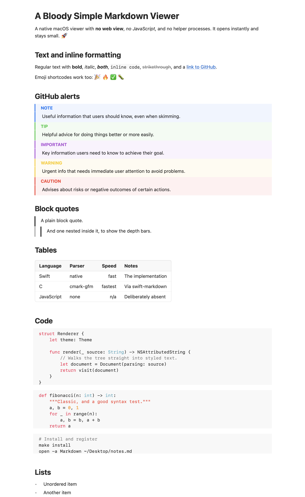

<div align="center">


# A Bloody Simple Markdown Viewer

**A native macOS Markdown viewer that opens instantly and stays small.**

No web view. No JavaScript. No helper processes.

</div>

It renders GitHub Flavored Markdown, plus what Claude and ChatGPT actually
produce, into native text. It can edit the file it is showing, print it, and be
driven from the command line by something that is not a person.

Made by [Matthias Sala](https://matthias.sala.ch), who wanted a fast way to look
at Markdown files and got tired of waiting for a browser engine to start up just
to read a to-do list.



## Why

Most Markdown viewers on macOS are a web browser in a trench coat. A single
`WKWebView` spawns three helper processes and costs around 138 MB before it has
rendered anything.

Measured on the same machine, macOS 15.7 on Apple Silicon:

| | This app | A WKWebView |
|---|---|---|
| Memory footprint, document open | 43 MB | 138 MB idle, 184 MB with content |
| Helper processes | 0 | 3 |
| Time to first paint | about 2.7x faster | baseline |

A 16 MB Markdown file opens and scrolls end to end in about 130 ms. There is no
paging and no sliding window: the whole file is parsed at once, and TextKit 2
lays out only what is on screen.

## What it does

**Reading**

- **Instant open.** No nib, no storyboard, no browser engine.
- **GitHub Flavored Markdown**: tables, task lists, strikethrough, autolinks,
  footnotes, and the five GitHub alert kinds (`> [!NOTE]` and friends).
- **Syntax-highlighted code** for sixteen languages, with no JavaScript engine.
- **LaTeX maths**, on the text baseline. Both GitHub's dollar delimiters and the
  backslash form ChatGPT emits.
- **Mermaid diagrams**, drawn natively, following light and dark mode.
- **Emoji shortcodes**, `:rocket:` and the rest.
- **Outline** of the document's headings, and **bookmarks** that survive the
  file being edited, moved or renamed.
- **Search**, literal or regular expression, with case and whole-word options.

**Checklists**

- **Task states beyond GitHub's two.** `[x]`, `[OK]` and `[DONE]` mean done;
  `[~]`, `[WIP]` and `[in progress]` mean started.
- **Filter the document to just the states you care about**, in the render or in
  the source.
- **Tick a box by clicking it.** The only edit the rendered view makes, and it
  goes straight into the Markdown. Option-click cycles the three states. The
  marker follows the spelling the file already uses, so a document written in
  emoji ticks stays that way.

**Working in a file**

- **Source mode.** Toggle to the raw Markdown, edit it, and save. Double-click
  anywhere in the render to land on the matching line.
- **See what changed underneath you.** When another program rewrites the file
  while you are reading it, the lines it touched stay highlighted, in a colour
  derived from the clock time of that save — one edit, one colour. Hovering says
  when. The marks last until you close the document.
- **Snippets.** Pull another file in with `![[file.md]]`, `@Snippet(file.md)` or
  `--8<-- "file.md"`, optionally one section with `#Heading`.
- **Copy a code block** from the button that appears when you hover it.

**Getting it out**

- **Print and export to PDF.** Paginated, with a running head and page numbers,
  as selectable text rather than a picture of text.
- **Share** to Mail, Messages or AirDrop from the system share sheet.
- **Finder previews.** Press space on a Markdown file and it renders.

**Fitting in**

- **Tabs that follow intent.** Files opened together share one window with tabs.
  A file opened on its own gets its own window. Drop a file on a window and it
  joins that window; drop it on the Dock icon and it opens a new one.
- **Everything in the title bar.** Tools and tabs share the row with the window
  buttons, so the document gets the whole window.
- **Light and dark**, following the system, with no second theme to maintain.

## Install

Requires macOS 15 or later, Apple Silicon or Intel.

```bash
brew install xcodegen      # only needed once
make install               # builds Release and installs to /Applications
make install-cli           # optional: puts mdv in /usr/local/bin
```

Then open a Markdown file and choose **Markdown > Make Default Markdown App**.
Setting the default handler is always an explicit choice; the app never seizes
your file associations on its own.

To work on the rendering engine alone, no Xcode project is needed:

```bash
swift test
```

The engine is a plain SwiftPM package. `project.yml` describes the app target
and XcodeGen generates the Xcode project, which is not committed because a
`.pbxproj` cannot be reviewed.

### If macOS says the app cannot be opened

Builds you make yourself are signed with your own certificate and just work. A
build downloaded from elsewhere carries a quarantine flag, and macOS 15 removed
the old right-click-to-open bypass, so either:

```bash
xattr -cr /Applications/Markdown.app
```

or open **System Settings > Privacy & Security**, scroll to the bottom and click
**Open Anyway**.

## For agents

A checklist maintained by an agent is exactly the kind of file this viewer is
for, and an agent cannot use a window. `mdv` exposes the same engine. Every
command takes `--json`, and the exit code says what happened without anyone
parsing output: `0` done, `1` could not, `2` nothing matched, `3` bad usage.

```bash
mdv outline notes.md                    # headings, with line numbers
mdv tasks notes.md --state open --json  # what is still open
mdv check notes.md "Quick Look"         # tick the box whose text matches
mdv search notes.md "TODO|FIXME" --regex
mdv text notes.md                       # the document as a human would read it
mdv pdf notes.md -o notes.pdf
mdv png notes.md -o notes.png --dark    # the screenshots here were made this way
mdv open notes.md other.md              # one window, two tabs
```

Ticking refuses an ambiguous match rather than guessing which box was meant, and
lists the candidates so the caller can narrow it:

```console
$ mdv check notes.md "e"
mdv: "e" matches 4 tasks - line 9: Parser fertig; line 10: Quick Look erweitern; ...
$ echo $?
2
```

## Snippets

A document can pull another file in. All three spellings work, because three
tools people use spell it three ways:

```markdown
![[install.md]]
![[guide.md#Getting Started]]
@Snippet(install.md)
--8<-- "install.md"
```

The app is sandboxed, so opening a document grants access to that one file and
nothing beside it. The first time a document asks for a snippet, you are asked
for its containing folder once, and the grant is remembered. Paths stay inside
that folder: an absolute path, a `~` or a climb out with `..` is refused rather
than read, because a viewer should not become a way to read your disk just
because someone sent you a document. A missing file or a loop renders as a
visible warning rather than a silent hole.

## Quick Look

Pressing space on a Markdown file in Finder shows it rendered, not as raw
source. The same extension serves the Finder preview pane, gallery view,
Spotlight results and Open panels.

macOS does not enable third-party Quick Look extensions automatically. If
previews still show plain text, open **System Settings > General > Login Items &
Extensions > Quick Look** and switch this one on.

Preview.app itself cannot be extended. Its document types are a fixed list in
its own Info.plist, it has no plug-ins directory, and it consumes no extension
point. A Quick Look extension is the closest achievable thing, and it covers
every system preview surface except Preview.app.

## Design notes

Several findings shaped this app, all established by probe rather than assumed.
They are the kind of thing that fails with no error at all, so they are written
down in [CONTRIBUTING.md](CONTRIBUTING.md) as well.

**`NSTextTable` does not work under TextKit 2.** Cells silently collapse into
plain sequential paragraphs, with no crash and no warning. The only way to make
it lay out is to drop the whole view back to TextKit 1, which forfeits lazy
viewport layout for the entire document - and that lazy layout is why a 16 MB
file opens instantly. Tables are therefore measured arithmetically and drawn.
`NSTextList` has the same character: it overrides the indentation you set,
putting every list marker in the same column regardless of nesting depth.

**Printing never instantiates attachment views.** A table or formula hosted as a
live view is simply absent from the page, with no error. Print and PDF re-render
in a flattened mode where those become block-based images that replay their
drawing into the page context, so the output stays vector and its text stays
selectable.

**Reading `NSTextView.layoutManager` is a one-way switch.** A single read, from
anywhere including a dependency, permanently drops the view to TextKit 1. The
code never touches it, and a debug assertion fires if anything does.

**A source position is a UTF-8 byte offset, never a UTF-16 index.** The two are
equal for as long as a document stays ASCII, so mixing them passes every test
and then puts bookmarks on the wrong line in the first file with an umlaut in
it.

The full design is in
[`docs/superpowers/specs`](docs/superpowers/specs/2026-09-19-markdown-viewer-design.md).

## Not yet

Mermaid covers flowchart, sequence, state, class, entity-relationship and pie
diagrams, which is most of what these tools emit. Gantt charts, mindmaps and
timelines are not supported yet and fall back to showing their source, so
nothing in your file is ever lost.

## Dependencies

Three, all permissively licensed, each behind a protocol so it can be swapped:

| Package | Purpose | Licence |
|---|---|---|
| [swift-markdown](https://github.com/swiftlang/swift-markdown) | CommonMark and GFM parsing, via cmark-gfm | Apache 2.0 |
| [SwaTex](https://github.com/PhraseHQ/SwaTex) | LaTeX typesetting, 129 of 130 common KaTeX commands | MIT |
| [swift-mermaid](https://github.com/Australware/swift-mermaid) | Diagram rendering | MIT |

Three defects in the diagram library are worked around rather than tolerated,
all found by testing it rather than reading its documentation. A diagram header
with no nodes yet produces an infinite size and crashes on rasterising, which a
streamed response hits constantly. A subgraph nested inside another of the same
name overflows the stack inside the library where it cannot be caught, so it is
refused beforehand. And its layout is only deterministic on one thread, so every
render is serialised.

## Contributing

See [CONTRIBUTING.md](CONTRIBUTING.md). It is short, and most of it is a list of
things on this platform that fail silently - worth reading before you spend an
afternoon rediscovering one of them.

Releases are cut by pushing a tag; the workflow signs and notarises the build.
See [docs/RELEASING.md](docs/RELEASING.md) for the secrets it needs.

## Licence

MIT. See [LICENSE](LICENSE).
